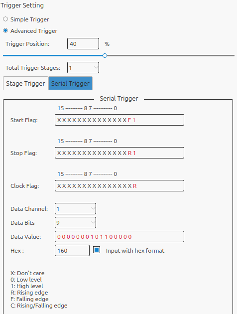

# Dreamsourcelab

## Links

https://www.dreamsourcelab.com/download/


## Install

```bash
$ sudo apt install git gcc g++ make cmake qt6-base-dev libqt6svg6 libgl1-mesa-dev libglib2.0-dev zlib1g-dev \
 	libusb-1.0-0-dev libboost-dev libfftw3-dev python3-dev libudev-dev pkg-config
$ git clone https://github.com/DreamSourceLab/DSView.git
$ cd DSview
$ cmake .
$ make 
$ sudo make install
[100%] Built target DSView
Install the project...
-- Install configuration: "Release"
-- Installing: /usr/local/bin/DSView
-- Up-to-date: /usr/local/share/DSView/res
-- Installing: /usr/local/share/DSView/res/DSLogicU2Pro16.bin
-- Installing: /usr/local/share/DSView/res/DSLogic33.bin
-- Installing: /usr/local/share/DSView/res/DSLogicU3Pro32.bin
-- Installing: /usr/local/share/DSView/res/DSCope20.fw
-- Installing: /usr/local/share/DSView/res/DSCopeC20P.bin
-- Installing: /usr/local/share/DSView/res/DSLogic2.def.dsc
-- Installing: /usr/local/share/DSView/res/DSCopeU2B20.bin
-- Installing: /usr/local/share/DSView/res/virtual-demo1.dsc
-- Installing: /usr/local/share/DSView/res/DSCopeU2P20.bin
-- Installing: /usr/local/share/DSView/res/DSLogicU2Basic-pgl12.bin
-- Installing: /usr/local/share/DSView/res/DSCopeU2B100.bin
-- Installing: /usr/local/share/DSView/res/license.txt
-- Installing: /usr/local/share/DSView/res/DSLogicPlus-pgl12.bin
-- Installing: /usr/local/share/DSView/res/DSCope2.def.dsc
-- Installing: /usr/local/share/DSView/res/DSLogic.fw
-- Installing: /usr/local/share/DSView/res/DSLogicPlus.bin
-- Installing: /usr/local/share/DSView/res/DSCope.fw
-- Installing: /usr/local/share/DSView/res/DSCopeC20B.bin
-- Installing: /usr/local/share/DSView/res/DSLogic1.def.dsc
-- Installing: /usr/local/share/DSView/res/DSLogicPro.fw
-- Installing: /usr/local/share/DSView/res/DSCope.bin
-- Installing: /usr/local/share/DSView/res/DSLogicU3Pro16.bin
-- Installing: /usr/local/share/DSView/res/DSLogicPro.bin
-- Installing: /usr/local/share/DSView/res/DSCope20.bin
-- Installing: /usr/local/share/DSView/res/DSCope1.def.dsc
-- Installing: /usr/local/share/DSView/res/DSLogicBasic.bin
-- Installing: /usr/local/share/DSView/res/DSCopeU3P100.bin
-- Installing: /usr/local/share/DSView/res/DSLogicU2Basic.bin
-- Installing: /usr/local/share/DSView/res/DSLogic0.def.dsc
-- Installing: /usr/local/share/DSView/res/DSLogic50.bin
-- Up-to-date: /usr/local/share/DSView/demo
-- Up-to-date: /usr/local/share/DSView/demo/analog
-- Installing: /usr/local/share/DSView/demo/analog/square.demo
-- Installing: /usr/local/share/DSView/demo/analog/sawtooth.demo
-- Installing: /usr/local/share/DSView/demo/analog/triangle.demo
-- Installing: /usr/local/share/DSView/demo/analog/sine.demo
-- Up-to-date: /usr/local/share/DSView/demo/dso
-- Installing: /usr/local/share/DSView/demo/dso/square.demo
-- Installing: /usr/local/share/DSView/demo/dso/sawtooth.demo
-- Installing: /usr/local/share/DSView/demo/dso/triangle.demo
-- Installing: /usr/local/share/DSView/demo/dso/sine.demo
-- Up-to-date: /usr/local/share/DSView/demo/logic
-- Installing: /usr/local/share/DSView/demo/logic/protocol.demo
-- Installing: /usr/local/share/DSView/logo.svg
-- Installing: /usr/local/share/icons/hicolor/scalable/apps/dsview.svg
-- Installing: /usr/local/share/pixmaps/dsview.svg
-- Installing: /usr/share/applications/dsview.desktop
-- Installing: /usr/lib/udev/rules.d/60-dreamsourcelab.rules
-- Installing: /usr/local/share/DSView/NEWS25
-- Installing: /usr/local/share/DSView/NEWS31
-- Installing: /usr/local/share/DSView/ug25.pdf
-- Installing: /usr/local/share/DSView/ug31.pdf
-- Installing: /usr/local/share/libsigrokdecode4DSL/decoders
-- Installing: /usr/local/share/libsigrokdecode4DSL/decoders/ir_irmp
-- Installing: /usr/local/share/libsigrokdecode4DSL/decoders/ir_irmp/pd.py
-- Installing: /usr/local/share/libsigrokdecode4DSL/decoders/ir_irmp/irmp_library.py
-- Installing: /usr/local/share/libsigrokdecode4DSL/decoders/qspi
-- Installing: /usr/local/share/libsigrokdecode4DSL/decoders/qspi/pd.py
-- Installing: /usr/local/share/libsigrokdecode4DSL/decoders/mcs48
-- Installing: /usr/local/share/libsigrokdecode4DSL/decoders/mcs48/pd.py
-- Installing: /usr/local/share/libsigrokdecode4DSL/decoders/avr_isp
-- Installing: /usr/local/share/libsigrokdecode4DSL/decoders/avr_isp/parts.py
-- Installing: /usr/local/share/libsigrokdecode4DSL/decoders/avr_isp/pd.py
-- Installing: /usr/local/share/libsigrokdecode4DSL/decoders/sdcard_sd
-- Installing: /usr/local/share/libsigrokdecode4DSL/decoders/sdcard_sd/pd.py
-- Installing: /usr/local/share/libsigrokdecode4DSL/decoders/numbers_and_state
-- Installing: /usr/local/share/libsigrokdecode4DSL/decoders/numbers_and_state/pd.py
-- Installing: /usr/local/share/libsigrokdecode4DSL/decoders/pan1321
-- Installing: /usr/local/share/libsigrokdecode4DSL/decoders/pan1321/pd.py
-- Installing: /usr/local/share/libsigrokdecode4DSL/decoders/st25r39xx_spi
-- Installing: /usr/local/share/libsigrokdecode4DSL/decoders/st25r39xx_spi/pd.py
-- Installing: /usr/local/share/libsigrokdecode4DSL/decoders/st25r39xx_spi/lists.py
-- Installing: /usr/local/share/libsigrokdecode4DSL/decoders/jtag_ejtag
-- Installing: /usr/local/share/libsigrokdecode4DSL/decoders/jtag_ejtag/pd.py
-- Installing: /usr/local/share/libsigrokdecode4DSL/decoders/ac97
-- Installing: /usr/local/share/libsigrokdecode4DSL/decoders/ac97/pd.py
-- Installing: /usr/local/share/libsigrokdecode4DSL/decoders/max7219
-- Installing: /usr/local/share/libsigrokdecode4DSL/decoders/max7219/pd.py
-- Installing: /usr/local/share/libsigrokdecode4DSL/decoders/can
-- Installing: /usr/local/share/libsigrokdecode4DSL/decoders/can/pd.py
-- Installing: /usr/local/share/libsigrokdecode4DSL/decoders/1-spi
-- Installing: /usr/local/share/libsigrokdecode4DSL/decoders/1-spi/pd.py
-- Installing: /usr/local/share/libsigrokdecode4DSL/decoders/usb_signalling
-- Installing: /usr/local/share/libsigrokdecode4DSL/decoders/usb_signalling/pd.py
-- Installing: /usr/local/share/libsigrokdecode4DSL/decoders/dsi
-- Installing: /usr/local/share/libsigrokdecode4DSL/decoders/dsi/pd.py
-- Installing: /usr/local/share/libsigrokdecode4DSL/decoders/onewire_network
-- Installing: /usr/local/share/libsigrokdecode4DSL/decoders/onewire_network/pd.py
-- Installing: /usr/local/share/libsigrokdecode4DSL/decoders/em4100
-- Installing: /usr/local/share/libsigrokdecode4DSL/decoders/em4100/pd.py
-- Installing: /usr/local/share/libsigrokdecode4DSL/decoders/miller
-- Installing: /usr/local/share/libsigrokdecode4DSL/decoders/miller/pd.py
-- Installing: /usr/local/share/libsigrokdecode4DSL/decoders/timing
-- Installing: /usr/local/share/libsigrokdecode4DSL/decoders/timing/pd.py
-- Installing: /usr/local/share/libsigrokdecode4DSL/decoders/morse
-- Installing: /usr/local/share/libsigrokdecode4DSL/decoders/morse/pd.py
-- Installing: /usr/local/share/libsigrokdecode4DSL/decoders/eeprom93xx
-- Installing: /usr/local/share/libsigrokdecode4DSL/decoders/eeprom93xx/pd.py
-- Installing: /usr/local/share/libsigrokdecode4DSL/decoders/rtc8564
-- Installing: /usr/local/share/libsigrokdecode4DSL/decoders/rtc8564/pd.py
-- Installing: /usr/local/share/libsigrokdecode4DSL/decoders/arm_etmv3
-- Installing: /usr/local/share/libsigrokdecode4DSL/decoders/arm_etmv3/pd.py
-- Installing: /usr/local/share/libsigrokdecode4DSL/decoders/cfp
-- Installing: /usr/local/share/libsigrokdecode4DSL/decoders/cfp/pd.py
-- Installing: /usr/local/share/libsigrokdecode4DSL/decoders/example
-- Installing: /usr/local/share/libsigrokdecode4DSL/decoders/example/pd.py
-- Installing: /usr/local/share/libsigrokdecode4DSL/decoders/ds243x
-- Installing: /usr/local/share/libsigrokdecode4DSL/decoders/ds243x/pd.py
-- Installing: /usr/local/share/libsigrokdecode4DSL/decoders/mxc6225xu
-- Installing: /usr/local/share/libsigrokdecode4DSL/decoders/mxc6225xu/pd.py
-- Installing: /usr/local/share/libsigrokdecode4DSL/decoders/ltc242x
-- Installing: /usr/local/share/libsigrokdecode4DSL/decoders/ltc242x/pd.py
-- Installing: /usr/local/share/libsigrokdecode4DSL/decoders/mrf24j40
-- Installing: /usr/local/share/libsigrokdecode4DSL/decoders/mrf24j40/pd.py
-- Installing: /usr/local/share/libsigrokdecode4DSL/decoders/mrf24j40/lists.py
-- Installing: /usr/local/share/libsigrokdecode4DSL/decoders/ook
-- Installing: /usr/local/share/libsigrokdecode4DSL/decoders/ook/pd.py
-- Installing: /usr/local/share/libsigrokdecode4DSL/decoders/sle44xx
-- Installing: /usr/local/share/libsigrokdecode4DSL/decoders/sle44xx/pd.py
-- Installing: /usr/local/share/libsigrokdecode4DSL/decoders/ir_rc5
-- Installing: /usr/local/share/libsigrokdecode4DSL/decoders/ir_rc5/pd.py
-- Installing: /usr/local/share/libsigrokdecode4DSL/decoders/ir_rc5/lists.py
-- Installing: /usr/local/share/libsigrokdecode4DSL/decoders/parallel
-- Installing: /usr/local/share/libsigrokdecode4DSL/decoders/parallel/pd.py
-- Installing: /usr/local/share/libsigrokdecode4DSL/decoders/ad5626
-- Installing: /usr/local/share/libsigrokdecode4DSL/decoders/ad5626/pd.py
-- Installing: /usr/local/share/libsigrokdecode4DSL/decoders/lfast
-- Installing: /usr/local/share/libsigrokdecode4DSL/decoders/lfast/pd.py
-- Installing: /usr/local/share/libsigrokdecode4DSL/decoders/1-i2c
-- Installing: /usr/local/share/libsigrokdecode4DSL/decoders/1-i2c/pd.py
-- Installing: /usr/local/share/libsigrokdecode4DSL/decoders/pca9571
-- Installing: /usr/local/share/libsigrokdecode4DSL/decoders/pca9571/pd.py
-- Installing: /usr/local/share/libsigrokdecode4DSL/decoders/em4305
-- Installing: /usr/local/share/libsigrokdecode4DSL/decoders/em4305/pd.py
-- Installing: /usr/local/share/libsigrokdecode4DSL/decoders/tlc5620
-- Installing: /usr/local/share/libsigrokdecode4DSL/decoders/tlc5620/pd.py
-- Installing: /usr/local/share/libsigrokdecode4DSL/decoders/avr_pdi
-- Installing: /usr/local/share/libsigrokdecode4DSL/decoders/avr_pdi/pd.py
-- Installing: /usr/local/share/libsigrokdecode4DSL/decoders/wiegand
-- Installing: /usr/local/share/libsigrokdecode4DSL/decoders/wiegand/pd.py
-- Installing: /usr/local/share/libsigrokdecode4DSL/decoders/guess_bitrate
-- Installing: /usr/local/share/libsigrokdecode4DSL/decoders/guess_bitrate/pd.py
-- Installing: /usr/local/share/libsigrokdecode4DSL/decoders/flexray
-- Installing: /usr/local/share/libsigrokdecode4DSL/decoders/flexray/pd.py
-- Installing: /usr/local/share/libsigrokdecode4DSL/decoders/atsha204a
-- Installing: /usr/local/share/libsigrokdecode4DSL/decoders/atsha204a/pd.py
-- Installing: /usr/local/share/libsigrokdecode4DSL/decoders/dali
-- Installing: /usr/local/share/libsigrokdecode4DSL/decoders/dali/pd.py
-- Installing: /usr/local/share/libsigrokdecode4DSL/decoders/dali/lists.py
-- Installing: /usr/local/share/libsigrokdecode4DSL/decoders/arm_itm
-- Installing: /usr/local/share/libsigrokdecode4DSL/decoders/arm_itm/pd.py
-- Installing: /usr/local/share/libsigrokdecode4DSL/decoders/c2
-- Installing: /usr/local/share/libsigrokdecode4DSL/decoders/c2/pd.py
-- Installing: /usr/local/share/libsigrokdecode4DSL/decoders/ds2408
-- Installing: /usr/local/share/libsigrokdecode4DSL/decoders/ds2408/pd.py
-- Installing: /usr/local/share/libsigrokdecode4DSL/decoders/z80
-- Installing: /usr/local/share/libsigrokdecode4DSL/decoders/z80/pd.py
-- Installing: /usr/local/share/libsigrokdecode4DSL/decoders/z80/tables.py
-- Installing: /usr/local/share/libsigrokdecode4DSL/decoders/spdif
-- Installing: /usr/local/share/libsigrokdecode4DSL/decoders/spdif/pd.py
-- Installing: /usr/local/share/libsigrokdecode4DSL/decoders/x2444m
-- Installing: /usr/local/share/libsigrokdecode4DSL/decoders/x2444m/pd.py
-- Installing: /usr/local/share/libsigrokdecode4DSL/decoders/ook_oregon
-- Installing: /usr/local/share/libsigrokdecode4DSL/decoders/ook_oregon/pd.py
-- Installing: /usr/local/share/libsigrokdecode4DSL/decoders/ook_oregon/lists.py
-- Installing: /usr/local/share/libsigrokdecode4DSL/decoders/i2s
-- Installing: /usr/local/share/libsigrokdecode4DSL/decoders/i2s/pd.py
-- Installing: /usr/local/share/libsigrokdecode4DSL/decoders/sda2506
-- Installing: /usr/local/share/libsigrokdecode4DSL/decoders/sda2506/pd.py
-- Installing: /usr/local/share/libsigrokdecode4DSL/decoders/a7105
-- Installing: /usr/local/share/libsigrokdecode4DSL/decoders/a7105/pd.py
-- Installing: /usr/local/share/libsigrokdecode4DSL/decoders/nes_gamepad
-- Installing: /usr/local/share/libsigrokdecode4DSL/decoders/nes_gamepad/pd.py
-- Installing: /usr/local/share/libsigrokdecode4DSL/decoders/adxl345
-- Installing: /usr/local/share/libsigrokdecode4DSL/decoders/adxl345/pd.py
-- Installing: /usr/local/share/libsigrokdecode4DSL/decoders/adxl345/lists.py
-- Installing: /usr/local/share/libsigrokdecode4DSL/decoders/t55xx
-- Installing: /usr/local/share/libsigrokdecode4DSL/decoders/t55xx/pd.py
-- Installing: /usr/local/share/libsigrokdecode4DSL/decoders/nrf24l01
-- Installing: /usr/local/share/libsigrokdecode4DSL/decoders/nrf24l01/pd.py
-- Installing: /usr/local/share/libsigrokdecode4DSL/decoders/sdcard_spi
-- Installing: /usr/local/share/libsigrokdecode4DSL/decoders/sdcard_spi/pd.py
-- Installing: /usr/local/share/libsigrokdecode4DSL/decoders/0-i2c
-- Installing: /usr/local/share/libsigrokdecode4DSL/decoders/0-i2c/pd.py
-- Installing: /usr/local/share/libsigrokdecode4DSL/decoders/dcf77
-- Installing: /usr/local/share/libsigrokdecode4DSL/decoders/dcf77/pd.py
-- Installing: /usr/local/share/libsigrokdecode4DSL/decoders/amulet_ascii
-- Installing: /usr/local/share/libsigrokdecode4DSL/decoders/amulet_ascii/pd.py
-- Installing: /usr/local/share/libsigrokdecode4DSL/decoders/amulet_ascii/lists.py
-- Installing: /usr/local/share/libsigrokdecode4DSL/decoders/usb_packet
-- Installing: /usr/local/share/libsigrokdecode4DSL/decoders/usb_packet/pd.py
-- Installing: /usr/local/share/libsigrokdecode4DSL/decoders/dmx512
-- Installing: /usr/local/share/libsigrokdecode4DSL/decoders/dmx512/pd.py
-- Installing: /usr/local/share/libsigrokdecode4DSL/decoders/tca6408a
-- Installing: /usr/local/share/libsigrokdecode4DSL/decoders/tca6408a/pd.py
-- Installing: /usr/local/share/libsigrokdecode4DSL/decoders/tdm_audio
-- Installing: /usr/local/share/libsigrokdecode4DSL/decoders/tdm_audio/pd.py
-- Installing: /usr/local/share/libsigrokdecode4DSL/decoders/ufcs
-- Installing: /usr/local/share/libsigrokdecode4DSL/decoders/ufcs/pd.py
-- Installing: /usr/local/share/libsigrokdecode4DSL/decoders/aud
-- Installing: /usr/local/share/libsigrokdecode4DSL/decoders/aud/pd.py
-- Installing: /usr/local/share/libsigrokdecode4DSL/decoders/mipi_rffe
-- Installing: /usr/local/share/libsigrokdecode4DSL/decoders/mipi_rffe/pd.py
-- Installing: /usr/local/share/libsigrokdecode4DSL/decoders/sipi
-- Installing: /usr/local/share/libsigrokdecode4DSL/decoders/sipi/pd.py
-- Installing: /usr/local/share/libsigrokdecode4DSL/decoders/xy2-100
-- Installing: /usr/local/share/libsigrokdecode4DSL/decoders/xy2-100/pd.py
-- Installing: /usr/local/share/libsigrokdecode4DSL/decoders/eth_an
-- Installing: /usr/local/share/libsigrokdecode4DSL/decoders/eth_an/pd.py
-- Installing: /usr/local/share/libsigrokdecode4DSL/decoders/pjdl
-- Installing: /usr/local/share/libsigrokdecode4DSL/decoders/pjdl/pd.py
-- Installing: /usr/local/share/libsigrokdecode4DSL/decoders/1-uart
-- Installing: /usr/local/share/libsigrokdecode4DSL/decoders/1-uart/pd.py
-- Installing: /usr/local/share/libsigrokdecode4DSL/decoders/gpib
-- Installing: /usr/local/share/libsigrokdecode4DSL/decoders/gpib/pd.py
-- Installing: /usr/local/share/libsigrokdecode4DSL/decoders/ook_vis
-- Installing: /usr/local/share/libsigrokdecode4DSL/decoders/ook_vis/pd.py
-- Installing: /usr/local/share/libsigrokdecode4DSL/decoders/cec
-- Installing: /usr/local/share/libsigrokdecode4DSL/decoders/cec/protocoldata.py
-- Installing: /usr/local/share/libsigrokdecode4DSL/decoders/cec/pd.py
-- Installing: /usr/local/share/libsigrokdecode4DSL/decoders/ir_sirc
-- Installing: /usr/local/share/libsigrokdecode4DSL/decoders/ir_sirc/pd.py
-- Installing: /usr/local/share/libsigrokdecode4DSL/decoders/ir_sirc/lists.py
-- Installing: /usr/local/share/libsigrokdecode4DSL/decoders/edid
-- Installing: /usr/local/share/libsigrokdecode4DSL/decoders/edid/pnpids.txt
-- Installing: /usr/local/share/libsigrokdecode4DSL/decoders/edid/config
-- Installing: /usr/local/share/libsigrokdecode4DSL/decoders/edid/pd.py
-- Installing: /usr/local/share/libsigrokdecode4DSL/decoders/ds1307
-- Installing: /usr/local/share/libsigrokdecode4DSL/decoders/ds1307/pd.py
-- Installing: /usr/local/share/libsigrokdecode4DSL/decoders/jtag
-- Installing: /usr/local/share/libsigrokdecode4DSL/decoders/jtag/pd.py
-- Installing: /usr/local/share/libsigrokdecode4DSL/decoders/common
-- Installing: /usr/local/share/libsigrokdecode4DSL/decoders/common/srdhelper
-- Installing: /usr/local/share/libsigrokdecode4DSL/decoders/common/srdhelper/mod.py
-- Installing: /usr/local/share/libsigrokdecode4DSL/decoders/common/plugtrx
-- Installing: /usr/local/share/libsigrokdecode4DSL/decoders/common/plugtrx/mod.py
-- Installing: /usr/local/share/libsigrokdecode4DSL/decoders/common/sdcard
-- Installing: /usr/local/share/libsigrokdecode4DSL/decoders/common/sdcard/mod.py
-- Installing: /usr/local/share/libsigrokdecode4DSL/decoders/graycode
-- Installing: /usr/local/share/libsigrokdecode4DSL/decoders/graycode/pd.py
-- Installing: /usr/local/share/libsigrokdecode4DSL/decoders/hdcp
-- Installing: /usr/local/share/libsigrokdecode4DSL/decoders/hdcp/pd.py
-- Installing: /usr/local/share/libsigrokdecode4DSL/decoders/lm75
-- Installing: /usr/local/share/libsigrokdecode4DSL/decoders/lm75/pd.py
-- Installing: /usr/local/share/libsigrokdecode4DSL/decoders/cjtag-oscan0
-- Installing: /usr/local/share/libsigrokdecode4DSL/decoders/cjtag-oscan0/pd.py
-- Installing: /usr/local/share/libsigrokdecode4DSL/decoders/seven_segment
-- Installing: /usr/local/share/libsigrokdecode4DSL/decoders/seven_segment/pd.py
-- Installing: /usr/local/share/libsigrokdecode4DSL/decoders/st7789
-- Installing: /usr/local/share/libsigrokdecode4DSL/decoders/st7789/pd.py
-- Installing: /usr/local/share/libsigrokdecode4DSL/decoders/am230x
-- Installing: /usr/local/share/libsigrokdecode4DSL/decoders/am230x/pd.py
-- Installing: /usr/local/share/libsigrokdecode4DSL/decoders/st7735
-- Installing: /usr/local/share/libsigrokdecode4DSL/decoders/st7735/pd.py
-- Installing: /usr/local/share/libsigrokdecode4DSL/decoders/swd
-- Installing: /usr/local/share/libsigrokdecode4DSL/decoders/swd/pd.py
-- Installing: /usr/local/share/libsigrokdecode4DSL/decoders/signature
-- Installing: /usr/local/share/libsigrokdecode4DSL/decoders/signature/pd.py
-- Installing: /usr/local/share/libsigrokdecode4DSL/decoders/jitter
-- Installing: /usr/local/share/libsigrokdecode4DSL/decoders/jitter/pd.py
-- Installing: /usr/local/share/libsigrokdecode4DSL/decoders/ade77xx
-- Installing: /usr/local/share/libsigrokdecode4DSL/decoders/ade77xx/pd.py
-- Installing: /usr/local/share/libsigrokdecode4DSL/decoders/ade77xx/lists.py
-- Installing: /usr/local/share/libsigrokdecode4DSL/decoders/fsi
-- Installing: /usr/local/share/libsigrokdecode4DSL/decoders/fsi/pd.py
-- Installing: /usr/local/share/libsigrokdecode4DSL/decoders/i2cfilter
-- Installing: /usr/local/share/libsigrokdecode4DSL/decoders/i2cfilter/pd.py
-- Installing: /usr/local/share/libsigrokdecode4DSL/decoders/ltc26x7
-- Installing: /usr/local/share/libsigrokdecode4DSL/decoders/ltc26x7/pd.py
-- Installing: /usr/local/share/libsigrokdecode4DSL/decoders/jtag_stm32
-- Installing: /usr/local/share/libsigrokdecode4DSL/decoders/jtag_stm32/pd.py
-- Installing: /usr/local/share/libsigrokdecode4DSL/decoders/counter
-- Installing: /usr/local/share/libsigrokdecode4DSL/decoders/counter/pd.py
-- Installing: /usr/local/share/libsigrokdecode4DSL/decoders/eeprom24xx
-- Installing: /usr/local/share/libsigrokdecode4DSL/decoders/eeprom24xx/pd.py
-- Installing: /usr/local/share/libsigrokdecode4DSL/decoders/eeprom24xx/lists.py
-- Installing: /usr/local/share/libsigrokdecode4DSL/decoders/qi
-- Installing: /usr/local/share/libsigrokdecode4DSL/decoders/qi/pd.py
-- Installing: /usr/local/share/libsigrokdecode4DSL/decoders/ds28ea00
-- Installing: /usr/local/share/libsigrokdecode4DSL/decoders/ds28ea00/pd.py
-- Installing: /usr/local/share/libsigrokdecode4DSL/decoders/i2cdemux
-- Installing: /usr/local/share/libsigrokdecode4DSL/decoders/i2cdemux/pd.py
-- Installing: /usr/local/share/libsigrokdecode4DSL/decoders/pwm
-- Installing: /usr/local/share/libsigrokdecode4DSL/decoders/pwm/pd.py
-- Installing: /usr/local/share/libsigrokdecode4DSL/decoders/lin
-- Installing: /usr/local/share/libsigrokdecode4DSL/decoders/lin/pd.py
-- Installing: /usr/local/share/libsigrokdecode4DSL/decoders/rc_encode
-- Installing: /usr/local/share/libsigrokdecode4DSL/decoders/rc_encode/pd.py
-- Installing: /usr/local/share/libsigrokdecode4DSL/decoders/lpc
-- Installing: /usr/local/share/libsigrokdecode4DSL/decoders/lpc/pd.py
-- Installing: /usr/local/share/libsigrokdecode4DSL/decoders/ad79x0
-- Installing: /usr/local/share/libsigrokdecode4DSL/decoders/ad79x0/pd.py
-- Installing: /usr/local/share/libsigrokdecode4DSL/decoders/cc1101
-- Installing: /usr/local/share/libsigrokdecode4DSL/decoders/cc1101/pd.py
-- Installing: /usr/local/share/libsigrokdecode4DSL/decoders/cc1101/lists.py
-- Installing: /usr/local/share/libsigrokdecode4DSL/decoders/maple_bus
-- Installing: /usr/local/share/libsigrokdecode4DSL/decoders/maple_bus/pd.py
-- Installing: /usr/local/share/libsigrokdecode4DSL/decoders/ir_rc6
-- Installing: /usr/local/share/libsigrokdecode4DSL/decoders/ir_rc6/pd.py
-- Installing: /usr/local/share/libsigrokdecode4DSL/decoders/ps2
-- Installing: /usr/local/share/libsigrokdecode4DSL/decoders/ps2/pd.py
-- Installing: /usr/local/share/libsigrokdecode4DSL/decoders/pxx1
-- Installing: /usr/local/share/libsigrokdecode4DSL/decoders/pxx1/pd.py
-- Installing: /usr/local/share/libsigrokdecode4DSL/decoders/rfm12
-- Installing: /usr/local/share/libsigrokdecode4DSL/decoders/rfm12/pd.py
-- Installing: /usr/local/share/libsigrokdecode4DSL/decoders/stepper_motor
-- Installing: /usr/local/share/libsigrokdecode4DSL/decoders/stepper_motor/pd.py
-- Installing: /usr/local/share/libsigrokdecode4DSL/decoders/midi
-- Installing: /usr/local/share/libsigrokdecode4DSL/decoders/midi/pd.py
-- Installing: /usr/local/share/libsigrokdecode4DSL/decoders/midi/lists.py
-- Installing: /usr/local/share/libsigrokdecode4DSL/decoders/caliper
-- Installing: /usr/local/share/libsigrokdecode4DSL/decoders/caliper/pd.py
-- Installing: /usr/local/share/libsigrokdecode4DSL/decoders/nunchuk
-- Installing: /usr/local/share/libsigrokdecode4DSL/decoders/nunchuk/pd.py
-- Installing: /usr/local/share/libsigrokdecode4DSL/decoders/sdq
-- Installing: /usr/local/share/libsigrokdecode4DSL/decoders/sdq/pd.py
-- Installing: /usr/local/share/libsigrokdecode4DSL/decoders/usb_power_delivery
-- Installing: /usr/local/share/libsigrokdecode4DSL/decoders/usb_power_delivery/pd.py
-- Installing: /usr/local/share/libsigrokdecode4DSL/decoders/swim
-- Installing: /usr/local/share/libsigrokdecode4DSL/decoders/swim/pd.py
-- Installing: /usr/local/share/libsigrokdecode4DSL/decoders/modbus
-- Installing: /usr/local/share/libsigrokdecode4DSL/decoders/modbus/pd.py
-- Installing: /usr/local/share/libsigrokdecode4DSL/decoders/adf435x
-- Installing: /usr/local/share/libsigrokdecode4DSL/decoders/adf435x/pd.py
-- Installing: /usr/local/share/libsigrokdecode4DSL/decoders/ssi32
-- Installing: /usr/local/share/libsigrokdecode4DSL/decoders/ssi32/pd.py
-- Installing: /usr/local/share/libsigrokdecode4DSL/decoders/arm_tpiu
-- Installing: /usr/local/share/libsigrokdecode4DSL/decoders/arm_tpiu/pd.py
-- Installing: /usr/local/share/libsigrokdecode4DSL/decoders/mdio
-- Installing: /usr/local/share/libsigrokdecode4DSL/decoders/mdio/pd.py
-- Installing: /usr/local/share/libsigrokdecode4DSL/decoders/pjon
-- Installing: /usr/local/share/libsigrokdecode4DSL/decoders/pjon/pd.py
-- Installing: /usr/local/share/libsigrokdecode4DSL/decoders/adns5020
-- Installing: /usr/local/share/libsigrokdecode4DSL/decoders/adns5020/pd.py
-- Installing: /usr/local/share/libsigrokdecode4DSL/decoders/xfp
-- Installing: /usr/local/share/libsigrokdecode4DSL/decoders/xfp/pd.py
-- Installing: /usr/local/share/libsigrokdecode4DSL/decoders/enc28j60
-- Installing: /usr/local/share/libsigrokdecode4DSL/decoders/enc28j60/pd.py
-- Installing: /usr/local/share/libsigrokdecode4DSL/decoders/enc28j60/lists.py
-- Installing: /usr/local/share/libsigrokdecode4DSL/decoders/iec
-- Installing: /usr/local/share/libsigrokdecode4DSL/decoders/iec/pd.py
-- Installing: /usr/local/share/libsigrokdecode4DSL/decoders/usb_request
-- Installing: /usr/local/share/libsigrokdecode4DSL/decoders/usb_request/pd.py
-- Installing: /usr/local/share/libsigrokdecode4DSL/decoders/onewire_link
-- Installing: /usr/local/share/libsigrokdecode4DSL/decoders/onewire_link/pd.py
-- Installing: /usr/local/share/libsigrokdecode4DSL/decoders/spi_tpm
-- Installing: /usr/local/share/libsigrokdecode4DSL/decoders/spi_tpm/README.md
-- Installing: /usr/local/share/libsigrokdecode4DSL/decoders/spi_tpm/pd.py
-- Installing: /usr/local/share/libsigrokdecode4DSL/decoders/spi_tpm/RangeDict.py
-- Installing: /usr/local/share/libsigrokdecode4DSL/decoders/spi_tpm/lists.py
-- Installing: /usr/local/share/libsigrokdecode4DSL/decoders/rgb_led_ws281x
-- Installing: /usr/local/share/libsigrokdecode4DSL/decoders/rgb_led_ws281x/pd.py
-- Installing: /usr/local/share/libsigrokdecode4DSL/decoders/ir_nec
-- Installing: /usr/local/share/libsigrokdecode4DSL/decoders/ir_nec/pd.py
-- Installing: /usr/local/share/libsigrokdecode4DSL/decoders/ir_nec/lists.py
-- Installing: /usr/local/share/libsigrokdecode4DSL/decoders/0-uart
-- Installing: /usr/local/share/libsigrokdecode4DSL/decoders/0-uart/pd.py
-- Installing: /usr/local/share/libsigrokdecode4DSL/decoders/spiflash
-- Installing: /usr/local/share/libsigrokdecode4DSL/decoders/spiflash/pd.py
-- Installing: /usr/local/share/libsigrokdecode4DSL/decoders/spiflash/lists.py
-- Installing: /usr/local/share/libsigrokdecode4DSL/decoders/nrf905
-- Installing: /usr/local/share/libsigrokdecode4DSL/decoders/nrf905/pd.py
-- Installing: /usr/local/share/libsigrokdecode4DSL/decoders/rgb_led_spi
-- Installing: /usr/local/share/libsigrokdecode4DSL/decoders/rgb_led_spi/pd.py
-- Installing: /usr/local/share/libsigrokdecode4DSL/decoders/microwire
-- Installing: /usr/local/share/libsigrokdecode4DSL/decoders/microwire/pd.py
-- Installing: /usr/local/share/libsigrokdecode4DSL/decoders/mlx90614
-- Installing: /usr/local/share/libsigrokdecode4DSL/decoders/mlx90614/pd.py
-- Installing: /usr/local/share/libsigrokdecode4DSL/decoders/can-fd
-- Installing: /usr/local/share/libsigrokdecode4DSL/decoders/can-fd/pd.py
-- Installing: /usr/local/share/libsigrokdecode4DSL/decoders/ieee488
-- Installing: /usr/local/share/libsigrokdecode4DSL/decoders/ieee488/pd.py
-- Installing: /usr/local/share/libsigrokdecode4DSL/decoders/0-spi
-- Installing: /usr/local/share/libsigrokdecode4DSL/decoders/0-spi/pd.py
-- Installing: /usr/local/share/libsigrokdecode4DSL/decoders/mipi_dsi
-- Installing: /usr/local/share/libsigrokdecode4DSL/decoders/mipi_dsi/pd.py
-- Installing: /usr/local/share/libsigrokdecode4DSL/decoders/sae_j1850_vpw
-- Installing: /usr/local/share/libsigrokdecode4DSL/decoders/sae_j1850_vpw/pd.py
-- Up-to-date: /usr/local/share/DSView/lang
-- Up-to-date: /usr/local/share/DSView/lang/cn
-- Installing: /usr/local/share/DSView/lang/cn/dsl_list.json
-- Installing: /usr/local/share/DSView/lang/cn/dsl_channel.json
-- Up-to-date: /usr/local/share/DSView/lang/cn/dec
-- Installing: /usr/local/share/DSView/lang/cn/dec/0.json
-- Installing: /usr/local/share/DSView/lang/cn/dec/u.json
-- Installing: /usr/local/share/DSView/lang/cn/dec/f.json
-- Installing: /usr/local/share/DSView/lang/cn/dec/p.json
-- Installing: /usr/local/share/DSView/lang/cn/dec/k.json
-- Installing: /usr/local/share/DSView/lang/cn/dec/a.json
-- Installing: /usr/local/share/DSView/lang/cn/dlg.json
-- Installing: /usr/local/share/DSView/lang/cn/toolbar.json
-- Installing: /usr/local/share/DSView/lang/cn/msg.json
-- Installing: /usr/local/share/DSView/lang/cn/dsl_label.json
-- Up-to-date: /usr/local/share/DSView/lang/en
-- Installing: /usr/local/share/DSView/lang/en/dlg.json
-- Installing: /usr/local/share/DSView/lang/en/toolbar.json
-- Installing: /usr/local/share/DSView/lang/en/msg.json
```


## Trigger for I2C 0x58

According to User Manual *2.4.3 Advanced Trigger*.

bin(0x58) -> 0b1011000
hex(0x58<<1) -> 0xB0
hex(0x58<<2) -> 0x160



```python
import time
from machine import Pin, I2C

i2c = I2C(0, scl=Pin(1), sda=Pin(0), freq=400_000)   # default assignment: scl=Pin(9), sda=Pin(8)
# i2c = I2C(1, scl=Pin(3), sda=Pin(2), freq=400_000)

while True:
    # print(i2c.scan())
    time.sleep(0.01)
    print([hex(a) for a in i2c.scan()])
    i2c.writeto(0x70, b'\xFF')
    time.sleep(0.01)
    i2c.writeto(0x58, b'\x00')
    time.sleep(0.01)
```