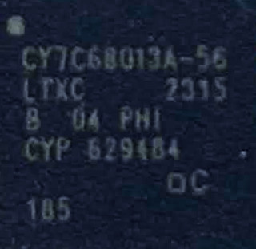
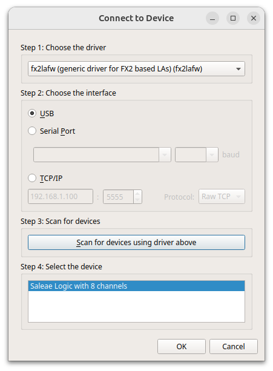

# Saleae Logic Clone

## Links
### sigrok

* https://sigrok.org/wiki/MCU123_Saleae_Logic_clone
* https://sigrok.org/wiki/Noname_Saleae_Logic_clone
* https://sigrok.org/wiki/Saleae_Logic/Info
* https://sigrok.org/bugzilla/show_bug.cgi?id=1152

## Aliexpress

USB Logic Analyzer 24MHz 8 Channel 24M/seconds Logic Analyzer Debugger For ARM FPGA Logic Analyzer Logic 24M 8CH

https://www.aliexpress.com/item/4000146595503.html

### CPU `Infineon CY7C68013A-56`



[Datasheet](https://www.infineon.com/dgdl/Infineon-CY7C68013A_CY7C68014A_CY7C68015A_CY7C68016A_EZ-USB_FX2LP_USB_Microcontroller_High-Speed_USB_Peripheral_Controller-DataSheet-v31_00-EN.pdf?fileId=8ac78c8c7d0d8da4017d0ec9f7974252)


## Simplest use

## AppImage

https://sigrok.org/wiki/Downloads#Binaries_and_distribution_packages

```bash
wget https://sigrok.org/download/binary/sigrok-cli/sigrok-cli-NIGHTLY-x86_64-release.appimage
wget https://sigrok.org/download/binary/sigrok-cli/sigrok-cli-NIGHTLY-x86_64-debug.appimage
wget https://sigrok.org/download/binary/pulseview/pulseview-NIGHTLY-x86_64-release.appimage
wget https://sigrok.org/download/binary/pulseview/pulseview-NIGHTLY-x86_64-debug.appimage
chmod a+x *.appImage
sudo ./pulseview-NIGHTLY-x86_64-debug.appimage
```




```bash
sudo ./sigrok-cli-NIGHTLY-x86_64-debug.appimage --scan
The following devices were found:
demo - Demo device with 13 channels: D0 D1 D2 D3 D4 D5 D6 D7 A0 A1 A2 A3 A4
fx2lafw - Saleae Logic with 8 channels: D0 D1 D2 D3 D4 D5 D6 D7
```

